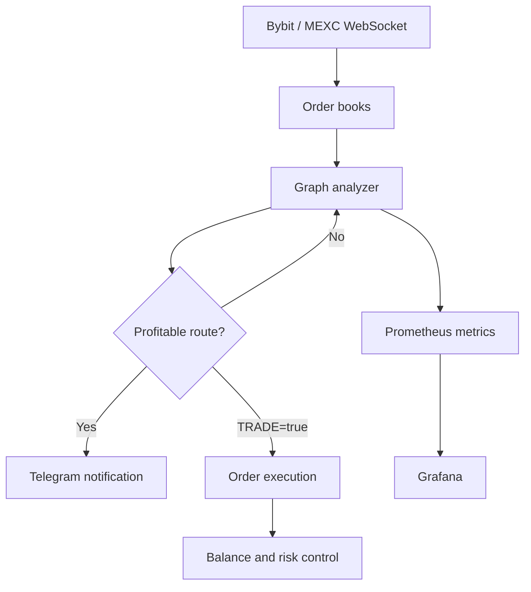

# Crypto Trade Bot

Дипломный проект по автоматизации внутрибиржевого арбитража цифровых активов на криптовалютных биржах **Bybit** и **MEXC**.

Система получает котировки в реальном времени, строит граф торговых пар, ищет циклические арбитражные маршруты, оценивает их с учётом комиссий и может автоматически исполнять последовательность сделок. Проект разработан в рамках выпускной квалификационной работы «Автоматизация процесса арбитража цифровых финансовых активов».

> Проект является исследовательским прототипом. По умолчанию реальная торговля отключена: `TRADE = false`.

## Возможности

- получение рыночных данных Bybit и MEXC через WebSocket;
- обработка JSON и Protocol Buffers;
- потокобезопасное хранение стаканов с `sync.RWMutex`;
- построение графа торговых пар;
- поиск циклических маршрутов произвольной глубины;
- расчёт результата с учётом комиссий, точности и доступной ликвидности;
- автоматическое создание и контроль ордеров;
- ограничение размера сделки и аварийная остановка при снижении баланса;
- логирование и уведомления в Telegram;
- метрики Prometheus через Pushgateway;
- дашборд Grafana;
- контейнерный запуск через Docker Compose.

## Архитектура



Основные компоненты находятся в `src/`:

| Каталог | Назначение |
| --- | --- |
| `analyzer` | Построение и анализ арбитражных маршрутов |
| `ws_connections` | WebSocket-подключения к биржам |
| `trade` | Создание ордеров и получение результатов сделок |
| `handlers` | Модели и потокобезопасная обработка стаканов |
| `config` | Переменные окружения и режим торговли |
| `stats` | Метрики Prometheus/Pushgateway |
| `alerting` | Уведомления Telegram |
| `logger` | Файловое логирование |

## Технологии

- Go 1.24;
- Bybit API и MEXC API;
- Gorilla WebSocket;
- Protocol Buffers;
- Docker и Docker Compose;
- Prometheus, Pushgateway и Grafana;
- Telegram Bot API.

## Результаты тестирования

Тестирование дипломного прототипа проводилось на Linux-сервере с 4 vCPU и 8 ГБ RAM.

| Метрика | Результат |
| --- | ---: |
| Задержка данных Bybit, 186 пар | менее 100 мс |
| Задержка данных MEXC, 200 пар | менее 120 мс |
| Анализ маршрута из 3 сделок | около 3 мс |
| Анализ маршрута из 5 сделок | около 30 мс |
| Полный цикл исполнения сделок | около 1,5 с |

Практическое тестирование показало, что большинство найденных связок становятся убыточными после учёта комиссий и проскальзывания. Для стандартного цикла из трёх сделок совокупная комиссия оценивалась примерно в 0,58% на Bybit и 0,15% на MEXC.

## Запуск

Требования: Docker с Docker Compose либо Go 1.24+.

```bash
cp .env.example .env
docker compose up --build
```

После запуска доступны:

- Grafana: <http://localhost:3000>
- Prometheus: <http://localhost:9090>
- Pushgateway: <http://localhost:9091>

Для локальной проверки:

```bash
go test ./...
go run .
```

## Конфигурация

Параметры задаются в `.env`:

| Переменная | Назначение |
| --- | --- |
| `API_KEY` | API key Bybit |
| `API_KEY_SECRET` | API secret Bybit |
| `ACCESS_KEY_MEXC` | API key MEXC |
| `SECRET_KEY_MEXC` | API secret MEXC |
| `TELEGRAM_TOKEN` | токен Telegram-бота |
| `TELEGRAM_CHAT_ID` | идентификатор чата для уведомлений |
| `GF_SECURITY_ADMIN_USER` | логин администратора Grafana |
| `GF_SECURITY_ADMIN_PASSWORD` | пароль администратора Grafana |

Не добавляйте `.env` в Git. Для биржевых ключей используйте минимально необходимые права, ограничение по IP и отключённый вывод средств.

Реальная торговля управляется параметром `TRADE` в `src/config/config.go` и по умолчанию отключена.

## Ограничения

- результат зависит от комиссий, ликвидности, задержек и проскальзывания;
- арбитражное окно может закрыться до завершения цепочки;
- API и форматы сообщений бирж могут изменяться;
- прототип не гарантирует прибыль и не предназначен для использования без дополнительного тестирования и управления рисками.
